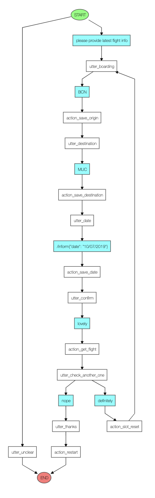

# KIWIBOT
## IMPOVING THE TRAVEL INDUSTRY ONE CHAT AT A TIME!
### This notebook is builds a [KIWI](https://www.kiwi.com/en/) flight search chatbot from scratch using RASA 

The notebook consists of four parts:
- Part 1: Installation and preparations
- Part 2: Start with a basic bot that can only understand natural language but no dialogues.
- Part 3: Add the abilitiy to understand multiturn dialogues.
- Part 4: Further resources so you can extend this simple demo.

###  Visualising the Training Data

  

